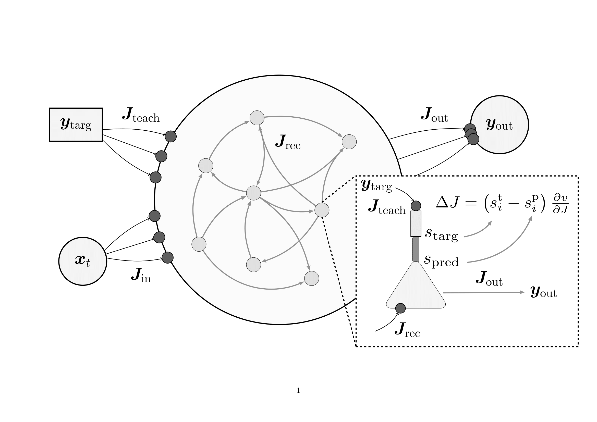
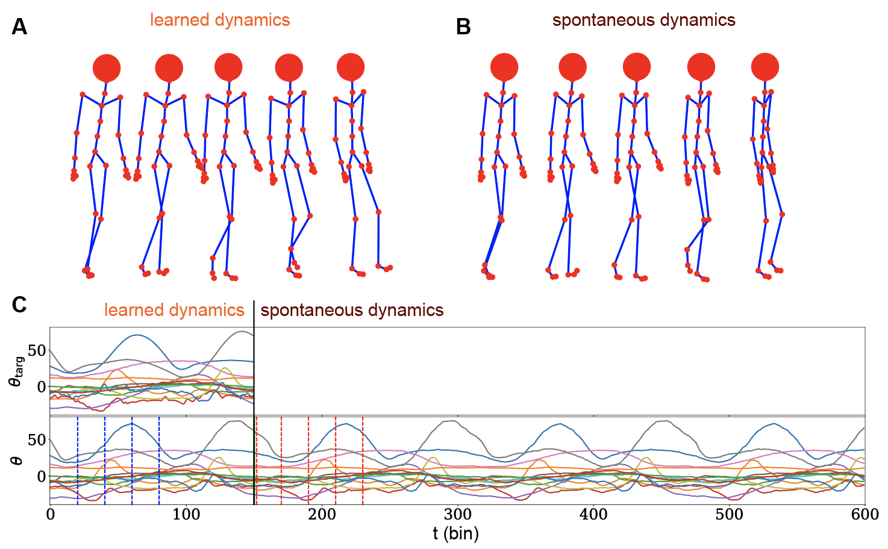
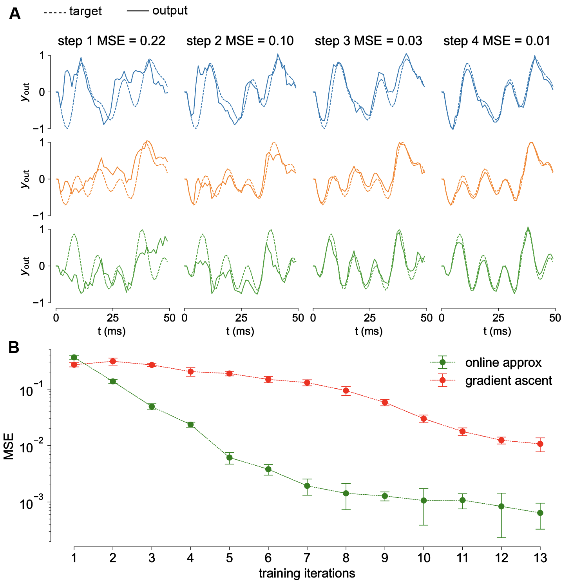

# Spike Pattern Based Learning (SPBL)
This is the Spike Pattern Based Learning (SPBL) repository for code associated to
the PLOS ONE paper: "*Target spiking patterns enable efficient and biologically plausible learning for complex temporal tasks - track changes*".

The model is implemented in the `spbl.py` module. A graphical depiction of the
system architecture is offered in the Figure below.



## How to Run the Code
The code is written in Python `3.7` and for correct execution the program requires
the following external dependences:

```
numpy
tqdm
```

To train the model (and save the results as `Trained Model.npy`) on the standard 3D trajectory task simply run:

`python test.py`

## Results

We test our model on several tasks. See our article for full analysis and descriptions.

### Temporal XOR
Here we report the results for the temporal
XOR, which is a non-linear temporal task in which the network is asked to performed
a delayed XOR computation given two inputs.


### Walking Dynamics
We tested our system on a real-life task: the generation of a 56-dimensional
walking dynamics. Our system was trained for 150ms and tested on 600ms, thus
providing strong evidence of the generalization capabilities of this model.



### Fast convergence
We tested our model on a smaller version of the 3D trajectory task to illustrate how
our model achieves very fast convergence to good solutions. We also compare the
performance of the *online approximation* to the exact gradient and found how it
is beneficial for performances. 



### Robustness to Noise
To asses the robustness of our model to noise we corrupt the input current with
a zero mean Gaussian noise of increasing variance. Indeed our voltage-dependent
training rule proved to be rather stable under input perturbation.


